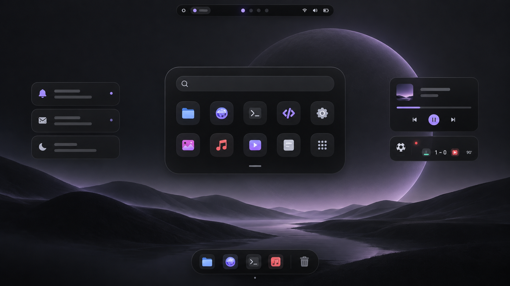

<p align="center">
  
</p>

<h1 align="center">Orla</h1>

<p align="center">
  Uma shell compacta e configurável para Wayland, construída com Quickshell e QML.
</p>

<p align="center">
  <strong>Português</strong> · <a href="README.en.md">English</a>
</p>

<p align="center">
  
  
  
  
</p>

O Orla reúne launcher, controles do sistema, notificações, mídia, tray, wallpapers e uma Live Activity de futebol em uma interface pequena e contínua. A estrutura segue papéis semânticos do Material Design 3, enquanto proporção, profundidade e movimento recebem um acabamento inspirado na Apple.

> [!NOTE]
> A imagem de abertura é uma visão conceitual da linguagem visual. A captura abaixo mostra a interface real em execução.

## Interface real

<p align="center">
  
</p>

O Orla cria uma barra por monitor. A ilha central parte do relógio e se expande no mesmo lugar para pesquisa ou controles do sistema, sem redimensionar a superfície Wayland a cada quadro da animação.

## Destaques

| Recurso | O que entrega |
| --- | --- |
| Ilha expansível | Relógio, launcher e controles do sistema em uma superfície contínua. |
| Launcher unificado | Pesquisa aplicativos, arquivos locais e histórico do navegador. |
| Controles rápidos | Áudio, microfone, rede, Bluetooth e mídia via serviços do Quickshell. |
| Notificações | Overlay, ações, resposta inline, pausa por interação e histórico da sessão. |
| Live Activity | Placar ao vivo para um time configurável, com tempo de jogo e escudos opcionais. |
| Wallpapers | Pesquisa e aplicação pelo `hyprpaper` em todos os monitores. |
| Configuração integrada | Tela visual e JSON para cores, fonte, movimento, relógio, launcher, notificações e mais. |
| Acessibilidade | Foco visível, navegação por teclado, nomes acessíveis e movimento reduzido. |

## Executar

É necessário estar em uma sessão Wayland com Hyprland. Com flakes habilitados:

```sh
nix run github:OdilonDamasceno/orla
```

Em um clone local:

```sh
nix run .
```

O pacote inclui Quickshell, Qt, a fonte Sunghyun Sans, `fd`, SQLite e `xdg-open`. A Live Activity consulta os jogos de futebol ao vivo pelo endpoint público do SofaScore; falhas de rede degradam somente essa integração.

## Instalar no NixOS

Adicione o projeto aos inputs da configuração:

```nix
inputs.orla = {
  url = "github:OdilonDamasceno/orla";
  inputs.nixpkgs.follows = "nixpkgs";
};
```

Depois, inclua o pacote no sistema:

```nix
outputs = inputs@{ nixpkgs, orla, ... }: {
  nixosConfigurations.seu-host = nixpkgs.lib.nixosSystem {
    system = "x86_64-linux";
    modules = [
      ({ pkgs, ... }: {
        environment.systemPackages = [
          orla.packages.${pkgs.stdenv.hostPlatform.system}.default
        ];
      })
    ];
  };
};
```

Uma configuração básica do Hyprland pode iniciar a shell e expor os launchers assim:

```ini
exec-once = orla
bind = $mainMod, Space, exec, orla ipc call launcher toggle
bind = ALT, W, exec, orla ipc call wallpapers toggle
```

## Personalizar

Abra o relógio e escolha **Configurações** para editar as preferências pela própria interface. As mudanças são aplicadas ao vivo e persistidas automaticamente. A tela também pode ser aberta por IPC:

```sh
orla ipc call settings toggle
```

O arquivo de usuário fica em `$XDG_CONFIG_HOME/orla/config.json` ou, por padrão, em `~/.config/orla/config.json`. Ele é opcional: propriedades ausentes recebem valores seguros e alterações em um arquivo existente são recarregadas automaticamente.

Em um clone do repositório, copie o exemplo completo:

```sh
mkdir -p ~/.config/orla
cp config.example.json ~/.config/orla/config.json
```

Uma configuração mínima pode conter apenas o que você quer substituir:

```json
{
  "locale": "pt_BR",
  "appearance": {
    "primaryColor": "#D0BCFF",
    "islandColor": "#000000",
    "animationScale": 1.0
  },
  "bar": {
    "clockFormat": "ddd d 'de' MMM hh:mm"
  },
  "liveActivity": {
    "team": "Flamengo",
    "refreshIntervalSeconds": 60,
    "showBadges": true
  }
}
```

Veja todas as propriedades e seus defaults em [`config.example.json`](config.example.json).

### Grupos disponíveis

- `appearance`: cores semânticas, fonte e escala das animações;
- `bar`: formato do relógio e visibilidade do tray e da Live Activity;
- `liveActivity`: time, intervalo de atualização e escudos;
- `launcher`: busca de arquivos, histórico, limites e diretório de wallpapers;
- `notifications`: timeout, limite do histórico e posição do overlay;
- `osd`: duração do indicador de volume;
- `accessibility`: movimento reduzido;
- `locale`: `pt_BR` ou `en_US`.

O intervalo da Live Activity é limitado a 15–600 segundos. A posição das notificações aceita `top-left`, `top-right`, `bottom-left` ou `bottom-right`. Caminhos iniciados por `~/` são expandidos para o diretório pessoal.

Configuração e estado ficam separados: preferências vivem em `$XDG_CONFIG_HOME`, enquanto a frequência de uso dos aplicativos fica em `$XDG_STATE_HOME/orla-launcher.json`.

## Usar o launcher

Os endpoints IPC podem ser chamados diretamente:

```sh
orla ipc call launcher toggle
orla ipc call launcher close
orla ipc call launcher isOpen
orla ipc call wallpapers toggle
orla ipc call wallpapers close
orla ipc call wallpapers isOpen
orla ipc call settings toggle
orla ipc call settings close
orla ipc call settings isOpen
```

Use as setas para navegar, `Enter` para abrir e `Escape` para fechar. A pesquisa de histórico abre o banco configurado somente para leitura; resultados externos são entregues ao aplicativo padrão do sistema.

## Desenvolver

Entre no ambiente e execute os arquivos do checkout:

```sh
nix develop
quickshell -n -p .
```

Antes de abrir outra instância, confirme que não existe uma shell ativa para evitar conflito de barras, notificações e atalhos.

Verifique os arquivos QML com:

```sh
bash scripts/check-qml.sh
```

Formate o projeto com:

```sh
qmlformat -i shell.qml components/*.qml services/*.qml singletons/*.qml surfaces/*.qml widgets/*.qml
```

O projeto ainda não possui uma suíte automatizada. Além do lint, valide a interface em uma sessão real e confira os logs:

```sh
quickshell log -p . -t 50 --no-color
```

## Estrutura

```text
shell.qml                  entrada, IPC e composição por monitor
components/                primitivas visuais reutilizáveis
services/                  busca, placar e ciclos de vida sem interface
singletons/Config.qml      carregamento e validação das preferências
singletons/Theme.qml       tokens semânticos derivados da configuração
singletons/I18n.qml        traduções pt_BR e en_US
surfaces/                  superfícies Wayland visíveis
widgets/                   launcher, controles, mídia e notificações
icons/                     ícones SVG locais
docs/assets/               imagens usadas pela documentação
```

Leia [`AGENTS.md`](AGENTS.md) antes de contribuir. Ele documenta decisões de design, convenções QML e o fluxo de validação do projeto.

## Estado do projeto

O Orla está em desenvolvimento ativo e atualmente é direcionado a Hyprland. Algumas integrações dependem do ambiente do sistema, como PipeWire, NetworkManager, Bluetooth, `hyprpaper` e a API pública do SofaScore. Ausências devem degradar a funcionalidade afetada sem impedir a inicialização da shell.

## Licença

Distribuído sob a [GNU General Public License v3.0](LICENSE).
